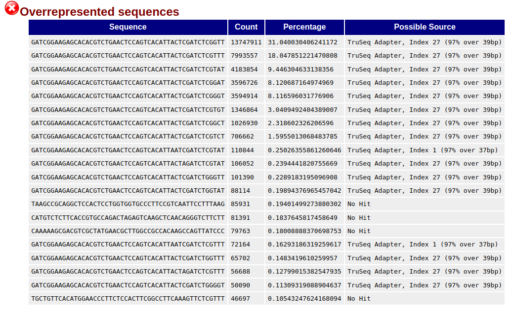

========================== Author: Layal Abo Khayal, PhD **** Edited:on 27.09.2024 ============================

## 1- check the quality of data before trimming

### 1-1 Installing and Running FastQC

The first step is to define the quality of the data by using FastQC on
the raw data before trimming the adapters from the sequencing

```{r}
if(!require(fastqcr)){
  install_github("kassambara/fastqcr")
}
library("fastqcr")
```

#### **Running FastQC from R**

FastQC is a Linux tool, it can be run in the command line. I used this R
package to facilitate reading the outputof the files quality

```{r eval=FALSE, include=FALSE}
fastqc(fq.dir = "~/Documents/EOC/Raw_RNA", # FASTQ files directory
       qc.dir = "~/Documents/EOC/QC_BT", # Results directory
       threads = 4                    # Number of threads
       )
```

### Aggregating Reports

```{r message=FALSE, warning=FALSE, paged.print=FALSE}
#Aggregating FastQC reports:
# QC Results directory
qc.dir = "~/Documents/EOC/QC_BT" 
qc <- fastqcr::qc_aggregate(qc.dir)
```

```{r}
qc

```

#### Summarizing Reports

We start by presenting a summary and general statistics of the
aggregated data.

```{r message=FALSE, warning=FALSE, paged.print=TRUE}
summary(qc)
```

## Ploting all the modules for all samples

```{r include=FALSE}
qc.dir = "~/Documents/EOC/QC_BT"
qcfiles <- list.files(path=qc.dir, pattern="*.zip", full.names=TRUE, recursive=FALSE)
nb_samples <- length(qcfiles)
nameQCf <- sub(".zip","", basename(qcfiles))
# To read all modules, specify: modules = "all"
modules <- c("Per sequence GC content","Per base sequence quality", "Per base sequence content", "Sequence Duplication Levels" )
qc_readAll <- fastqcr::qc_read_collection(qcfiles, sample_names =nameQCf, modules = "all")

```

## The precentage of GC content

This module failed in all sample and it shows very high percentage of GC which refers to This module will indicate a failure if the sum of the deviations from the normal distribution represents more than 30% of the readsSharp peaks on an otherwise smooth distribution are normally the result of a specific contaminant (adapter dimers for example), which may well be picked up by the overrepresented sequences module. Broader peaks may represent contamination with a different species. We can decide if the data is contaminated if the GC percentage stay higher than 30% after trimming the adapters

```{r}
# Plot per sequence GC content
jpeg(filename = "GC content in all files" , width = 800, height = 600 )
fastqcr::qc_plot_collection(qc_readAll, "Per sequence GC content")
dev.off()
```

```{r fig.height=8, fig.width=12}
fastqcr::qc_plot_collection(qc_readAll, "Per sequence GC content")
```

<br> 
## Overrepresented sequences: This the concerns in this data
Finding that a single sequence is very overrepresented in the set either means that it is highly biologically significant, or indicates that the library is contaminated, or not as diverse as you expected. This module lists all of the sequence which make up more than 0.1% of the total. To conserve memory only sequences which appear in the first 100,000 sequences are tracked to the end of the file. It is therefore possible that a sequence which is overrepresented but doesn't appear at the start of the file for some reason could be missed by this module.
<br> 


## Plotting the failed modules

From the summary of the aggregated report are: 
<br> 
1. **Adapter Content**: it is normal to fail because we need to trim the sequencing adapters from the reads. in the following plot how the raw data looks like:

```{r fig.height=12, fig.width=12}
fastqcr::qc_plot_collection(qc_readAll, "Adapter Content")
```

<br> 
<br> 
2. **Per Base Sequence Content** : This module will fail if the difference between A and T, or G and C is greater than 20% in any
position. it failed in all sample

```{r message=FALSE, warning=FALSE, paged.print=FALSE}
qc_R1 <- fastqcr::qc_read(qcfiles[1])
```

```{r fig.height=8, fig.width=10, message=FALSE, warning=FALSE, paged.print=TRUE}
fastqcr::qc_plot(qc_R1, "Per Base Sequence Content" )
```


3. **Per base sequence quality**
This module will raise a failure if the lower quartile for any base is less than 5 or if the median for any base is less than 20
It looks like there was a technical issue in the sequencer(as a bobble or so) in 9 sample, because the quality suddenly dropped down in the middle of the samples.


```{r fig.height=8, fig.width=12}
fastqcr::qc_plot_collection(qc_readAll, "Per base sequence quality")
```
#Plot all modules for all Samples
```{r message=FALSE, warning=FALSE, paged.print=FALSE}
#qcfiles <- list.files(path=qc.dir, pattern="*.zip", full.names=TRUE, recursive=FALSE)
#nb_samples <- length(qcfiles)
#nameQCf <- sub(".zip","", basename(qcfiles))
qcR <- qc_read(qcfiles[1])
mod <- c("Adapter Content","per base sequence quality", "per sequence quality scores" ,"per base sequence content","per sequence gc content","per base n content", "sequence length distribution", "sequence duplication levels" )

```


```{r}
print(nameQCf[1] )
par(mfrow=c(4,2))
fastqcr::qc_plot(qcR, mod[1] )
fastqcr::qc_plot(qcR, mod[2] )
fastqcr::qc_plot(qcR, mod[3] )
fastqcr::qc_plot(qcR, mod[4] )
fastqcr::qc_plot(qcR, mod[5] )
fastqcr::qc_plot(qcR, mod[6] )
fastqcr::qc_plot(qcR, mod[7] )
fastqcr::qc_plot(qcR, mod[8] )
```


```{r}
library(dplyr)
qc %>%
  select(sample, module, status) %>%    
  filter(status %in% c("WARN", "FAIL")) %>%
  arrange(sample)
```

### Per Module Problems

#### Modules that failed in the most samples:

```{r}
qc_fails(qc, "module")
```

### Per Sample Problems

-   **Samples with one or more failed modules**:

```{r}
# See which samples had one or more failed modules
qc_fails(qc, "sample")
```

